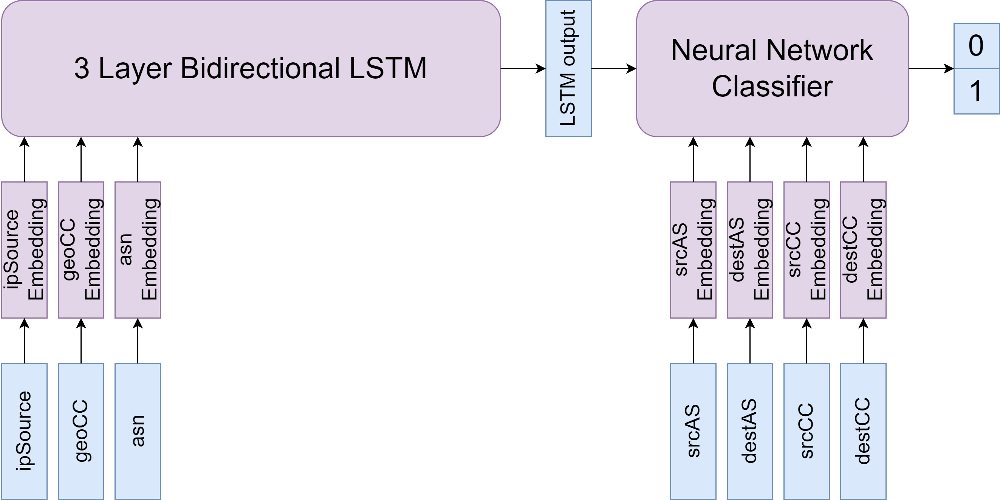

# Geo Route Challenge

## How to use this repository

There are four notebooks in this repository. Run them in the following order:

1. Trainiing Dataset Preparation

This notebook will read the file `dataset_b_noisy_7_agents_training.pkl` and create a compressed data file named `dataset_training.pkl.gz`. Also this notebook will replace all non-numeric features by enconding them. These encodings are stored in the YAML files `mapping_srcAS.yaml`, `mapping_destAS.yaml`, `mapping_srcCC.yaml` and `mapping_destCC.yaml`, which also will be created by this notebook. Also for columns that contain lists new columns will be created.

2. Test Dataset Preparation

This notebook will use the mapping files created in the first notebook and transform the test dataset from the `dataset_b_noisy_7_agents_test.pkl` into a new file named `dataset_test.pkl.gz`.

3. GeoRouteLSTM Training

This notebook will train the GeoRouteLSTM model and save the weight in a file named `lstm_3layers_<datestring>`.

4. GeoRouteLSTM Evaluation

This notebook evaluates the trained model from the last notebook on the test dataset.

## The architecture

All features are run through separate embedding layers. The sequential features are also run through a 3 layer bidirectional LSTM model. The outputs of the LSTM model and all the non-sequential features are then run through a feed forward neural network.

